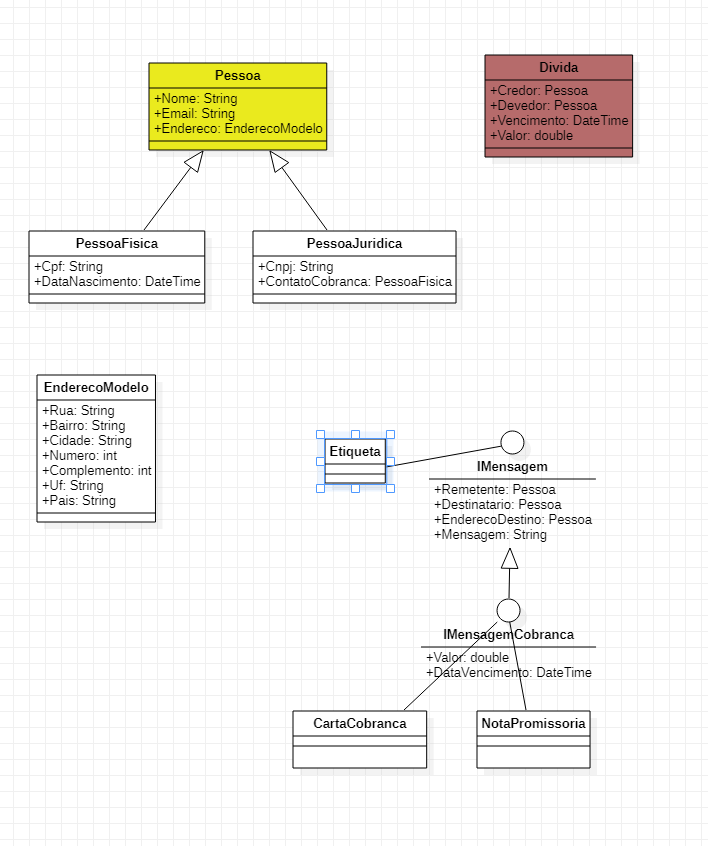

# Exercício da aula 4 - 07/01/2021

## Classes

- Pessoa Física
  - Nome
  - Email
  - Endereço
  - CPF
  - Data de nascimento
- Pessoa Jurídica
  - Nome
  - Email
  - Endereço
  - CNPJ
  - Contato (pessoa física)

## Para um vetor de pessoas

- Imprimir etiqueta para correspondência
- Imprimir carta de cobrança
- Imprimir nota promissória (valor passado por parâmetro)

----
### Modelos:

1. Etiqueta para correspondência:
	 1. pessoa física:
          José da Silva
          Rua tal, 123/100...
    2. pessoa jurídica:
        Empresa X Ltda
        Aos cuidados de José da Silva
        Rua tal, 123/100...
2. Carta de cobrança:
        1. Caso pessoa física:
            Caro(a) José da Silva, você me deve!
            2. Caso pessoa jurídica:
            Caro José da Silva, a Empresa X Ltda me deve!
  3. Nota promissória:
         1. Caso pessoa física:
        Eu José da Silva prometo que vou pagar R$ na data ...
            2. Caso pessoa jurídica:
               Eu José da Silva representante legal da empresa x prometo que vou pagar

---

### Extras

- Criar uma classe endereço
- Endereço
  - Rua
  - Bairro
  - Cidade
  - Número
  - Complemento
  - Unidade da federação
  - País

- Criar uma interface IMensagemCobranca
  - Ela vai ser assinada por "Etiqueta", "Carta de Cobrança" e "Nota promissória"
  - Conterá:
    - Remetente
    - Destinatário (PJ ou PF)
    - Valor
    - Endereço

---

### Revendo o planejamento

- Criar a classe Dívida e gerar as mensagens a partir dela?
- Carta de cobrança e Nota promissória precisam ter uma etiqueta?
  - Acredito que sim. Então vou ter que mudar o diagrama abaixo
  - Cada mensagem vai ter sua etiqueta.
- As mensagens serão geradas a partir de um objeto dívida ou por um construtor que passa todas as propriedades
  - Gostei mais da primeira opção, então vou ter que mudar todas as classes de mensagem!

